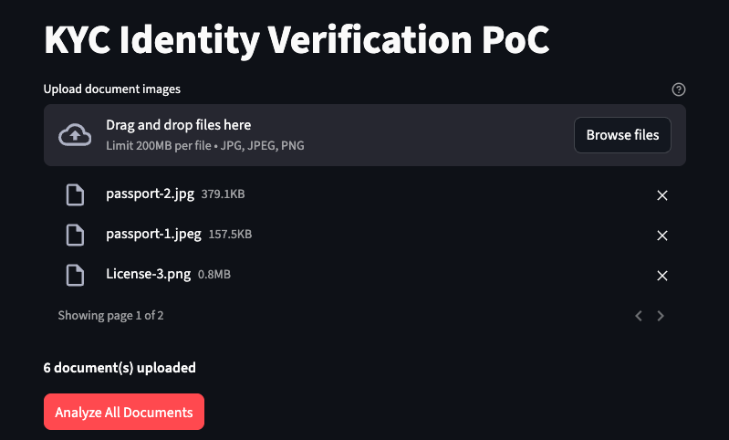
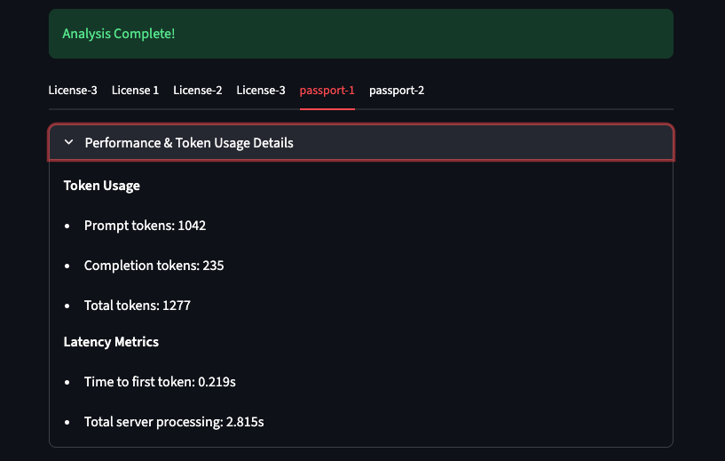
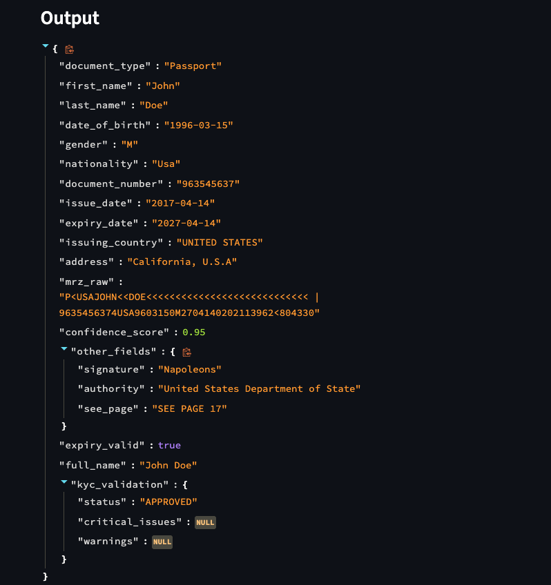
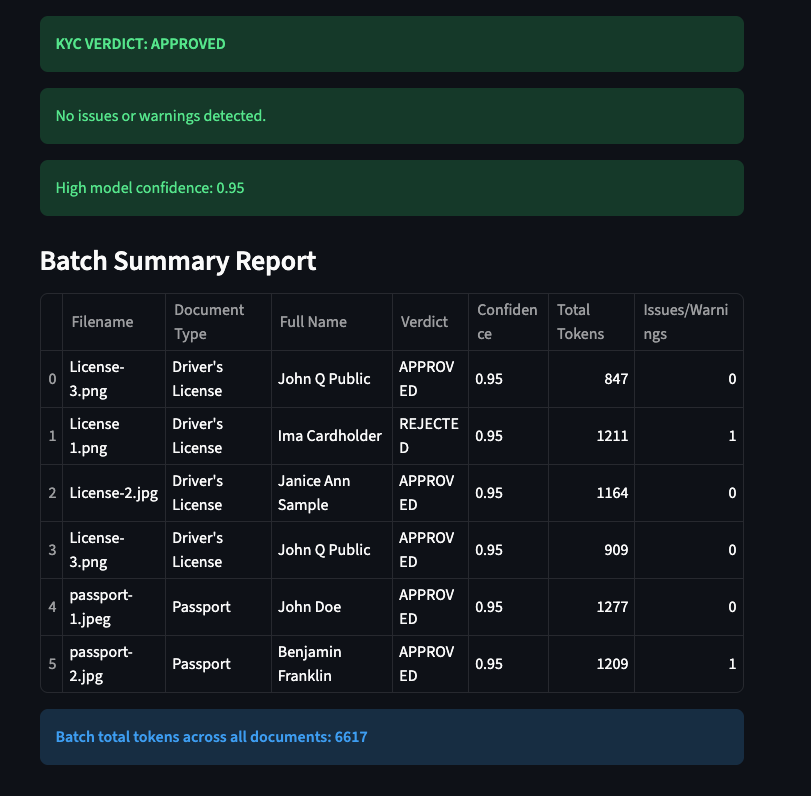

# KYC Identity Verification PoC using Fireworks AI

## Overview

End-to-end PoC for KYC identity verification: extracts structured data from passport and driver's license images using Fireworks AI's vision-language model, with post-processing, normalization, and rule-based validation to deliver a compliance verdict.

## Quick Start

### Prerequisites
- Python 3.10+
- Fireworks AI account and API key (create at https://fireworks.ai/)

### Local Installation
```bash
git clone https://github.com/amanzoni1/kyc-identity-verification-poc.git
cd kyc-identity-verification-poc

python -m venv venv
source venv/bin/activate    # On macOS/Linux
#venv\Scripts\activate      # On Windows

# Install dependencies
pip install -r requirements.txt

# Set API key
export FIREWORKS_API_KEY="your_key_here"
```

### Run the App
```bash
streamlit run app.py
```

Open http://localhost:8501 in your browser.

### Alternative: Run with Docker
```bash
docker build -t kyc-poc .

docker run -p 8501:8501 -e FIREWORKS_API_KEY="your_key_here" kyc-poc
```
Open http://localhost:8501 in your browser.

## Usage
1. Upload one or more document images (.jpg, .jpeg, .png).
2. Click "Analyze Document".
3. View extracted JSON, validation verdict, and token/latency metrics for any docs.

### Testing on Provided Samples

The assignment includes 5 sample documents here:
https://drive.google.com/drive/u/0/folders/1GNyJZ8bluOg_TBuYFfrSsE4WfRsLYEcN


## Design Decisions & Trade-offs

The assignment explicitly asked for documentation of design choices and their trade-offs. Below is a detailed breakdown of the most important decisions.

1. **End-to-End Vision-Language Model Extraction**
   - **Choice**: Direct image-to-structured-JSON extraction using a Fireworks vision-language model.
   - **Rationale**: The task requires using Fireworks AI's platform, which excels at multimodal models capable of understanding document layouts, abbreviations, and semantics in a single API call. This simplifies the pipeline and handles layout variations robustly.
   - **Trade-offs**: Higher cost/latency than pure OCR, with minor hallucination risk (mitigated by deterministic settings and post-processing). Overall, superior accuracy and simplicity.

2. **Model Selection**
   - **Choice**: `accounts/fireworks/models/qwen3-vl-30b-a3b-instruct` (30B parameters, Instruct variant).
   - **Rationale**: For a quick PoC, I prioritized serverless deployment (simple, no management overhead). Among available serverless vision models on Fireworks, the 30B Instruct variant provided the best balance of cost, speed, and document understanding, with excellent empirical results on the samples. The Instruct tuning is ideal for structured extraction tasks.
   - **Alternatives Considered**: Larger MoE variants (higher accuracy but increased cost); Thinking variants (better for reasoning but unnecessary here). Dedicated (non-serverless) deployments could enable smaller models for even lower cost, but serverless was preferred for PoC simplicity.
   - **Trade-offs**: May miss very fine handwritten details; production could add confidence-based routing to larger models.

3. **Structured Output: json_object vs json_schema**
   - **Choice**: `response_format={"type": "json_object"}` with a detailed prompt-defined schema (instead of strict `json_schema`).
   - **Rationale**: Document extraction involves ambiguity (abbreviations, partial text, layout variations). Strict `json_schema` (Fireworks' recommended default) enforces guarantees but reduces recall—the model conservatively nulls uncertain fields. `json_object` prioritizes higher recall, outputting best-guess values that downstream deterministic post-processing (Pydantic + normalization) can reliably clean and validate. Empirical testing showed better field completeness this way.
   - **Trade-offs**:

     | Mode            | Pros                                   | Cons                                      |
     |-----------------|----------------------------------------|-------------------------------------------|
     | json_schema     | Hard guarantees, no hallucinated fields| Lower recall on ambiguous/partial text    |
     | json_object     | Higher recall, flexible for real-world variations | Requires robust post-processing (which we have via Pydantic) |

     The Pydantic layer complements (rather than duplicates) this choice—it handles normalization and validation that `json_schema` can't fully cover (e.g., date parsing, field synthesis). I evaluated that `json_schema` suits clean text domains while `json_object` is better here.

4. **Image Preprocessing**
   - **Choice**: Resize to ≤1024px + JPEG compression (quality=85).
   - **Rationale**: Standard practice for vision models to control token usage/latency while preserving legibility. Even though the provided samples are lower resolution, capping at 1024px ensures consistency for real-world higher-res uploads (e.g., phone photos) and keeps prompt tokens ~800–1000.
   - **Trade-offs**: Minor quality loss on ultra-high-res images (negligible for document text extraction).

5. **Post-Processing & Validation**
   - **Choice**: Pydantic model + custom normalization + rule-based KYC checks.
   - **Rationale**: Ensures standardized, compliant output and explainable verdicts required in FSI. Model confidence is used only as a heuristic.
   - **Trade-offs**: Rules require maintenance for regulatory changes; prioritizes auditability over pure ML flexibility.

6. **API Configuration**
   - **Choice**: temperature=0.0, top_p=0.95, max_tokens=1024, perf_metrics enabled.
   - **Rationale**: Temperature=0.0 for deterministic, reproducible extractions (critical for KYC). top_p=0.95 as a safe default (has minimal effect with temp=0 but allows slight diversity if needed in variants). Metrics for cost/latency monitoring.
   - **Trade-offs**: Low temperature limits exploration but ensures consistency.

7. **UI Choice: Streamlit**
   - **Choice**: Interactive demo with multi-document batch support.
   - **Rationale**: Enables rapid, hands-on evaluation by technical and non-technical reviewers.
   - **Trade-offs**: Not production-ready, ok for PoC.

## Performance on Provided Samples

| Metric              | Value                                      |
|---------------------|--------------------------------------------|
| Extraction Accuracy | All 5 documents: core fields fully extracted |
| Average Latency     | ~3–4 seconds end-to-end                    |
| Token Usage         | ~900 prompt + ~250 completion tokens       |
| Estimated Cost      | ~$0.0002–0.0003 per document               |

## Sample Outputs

Below are screenshots from processing one of the provided sample documents (a Driver's License).

### Docs Upload


### Docs Metrics


### Docs Output


### Docs Val & Summary


## Limitations & Future Improvements

This is a PoC focused on demonstrating an end-to-end solution using Fireworks AI for structured document extraction and basic KYC decisioning.

- **Confidence Score**: Currently a model-generated heuristic (useful signal but not calibrated). In production, this could be enhanced.
- **Validation Rules**: Simple rule-based checks prioritized for explainability and demo clarity. Real KYC systems would integrate additional signals.
- **Error Resilience**: Basic error handling; production would add retries, circuit breakers, logging, and fallback to manual review queues.

These extensions would increase robustness and compliance while preserving the core vision-language extraction pipeline.

---

Thank you for the opportunity!
